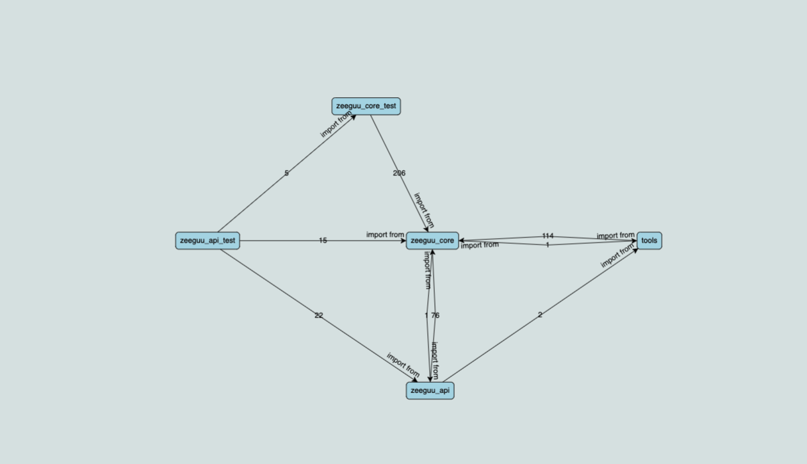

# architecture-recovery

The problem this tool is trying to solve, is that regardless of it’s many benefits, architectural documentation often becomes obsolete. With projects progress, more frequently the focus is on the code and technical progress, rather than maintaining, sometimes even creating architectural documentation.
To gain the above mentioned benefits of having an architectural description, but also taking into account the real-life situations when software projects often lack the focus and the time for creating one, this report will outline the process of building a tool to dynamically generate one or more architectural views and to present them in a visual format. The target for the diagram is somebody that is not familiar with the system and needs to get a high-level understanding of it.

### Diagram tool

For visualisations, I am using a tool built by Northwoods Software for [GoJS 2.1](https://gojs.net).

## Installation

Start by running `npm install` to install all necessary dependencies.

## Available Scripts

In the project directory, you can run:

### `npm start`

Runs the app. Open [http://localhost:5000](http://localhost:5000) to view it in the browser.

### `npm run dev`

Runs the app in the development mode. 
Open [http://localhost:5000](http://localhost:5000) to view it in the browser.

The page will reload if you make edits. 
You will also see any lint errors in the console.

## Results

On the page will be displayed an interactive Module View with Dependency Cardinality for the Zeegu-API project 
